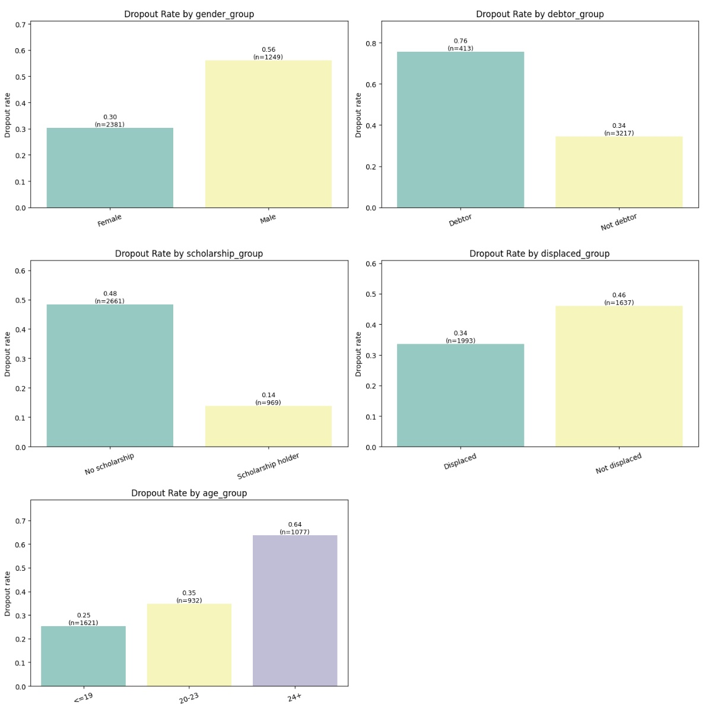
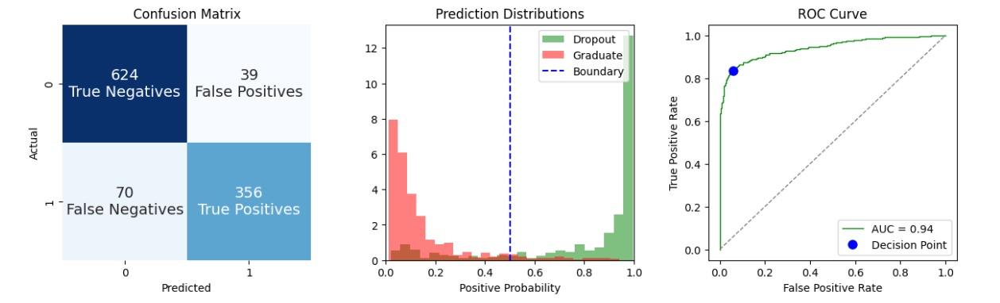
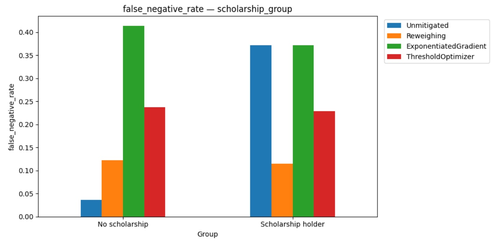
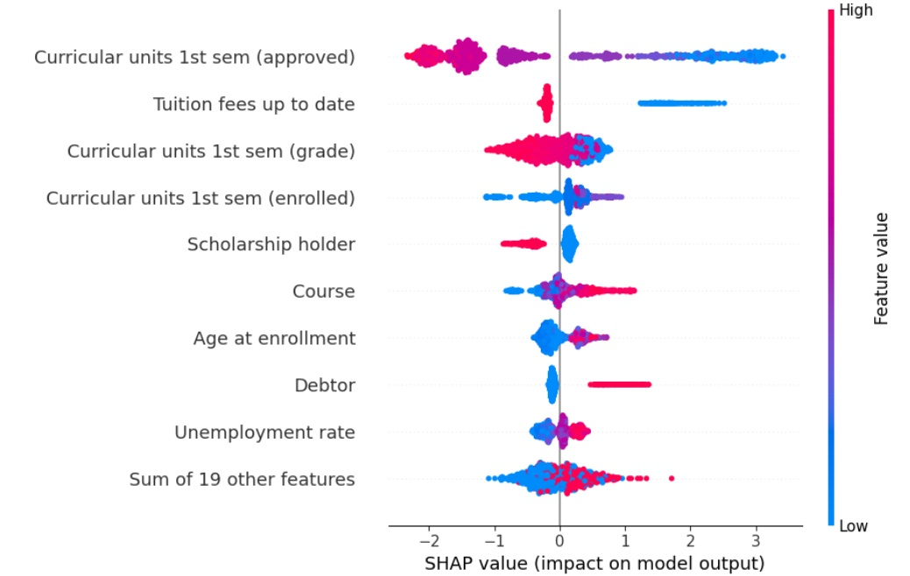
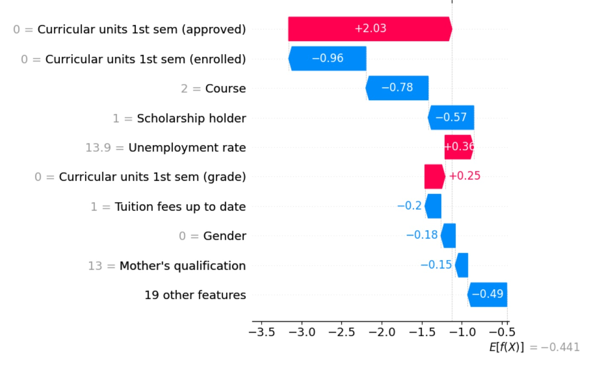

# Student Dropout Risk Prediction
### Fair & Explainable Early Intervention

> University course project — AI Interpretability & Fairness  
> MSc Business Analytics, Católica Lisbon School of Business & Economics  
> Group 6 — Dominik Plöchl, Niccolò Germani, Rahul Rajesh

---

## Overview

This project builds a fairness-aware machine learning system that identifies university students at risk of dropping out after their first semester, with the goal of triggering early academic and financial support interventions.

The core question: **can a university flag at-risk students early enough to intervene — and do so without systematically missing certain groups?**

We show that standard ML models, even high-performing ones, produce significant fairness gaps across demographic groups — and that targeted mitigation strategies can substantially reduce these gaps at modest accuracy cost.

---

## The Problem

**Organisational decision:** Which students should be prioritised for proactive support (tutoring, financial counselling, mental health resources) after Semester 1, based on predicted dropout risk?

**Why fairness matters here:** A false negative — an at-risk student the model misses — means that student receives no support and may drop out as a direct consequence. This is the primary harm. False negatives that systematically affect certain demographic groups reproduce structural inequality through the intervention system itself.

**Decision point:** End of Semester 1. Using only enrollment-time features would flag students on background alone, before any academic signal exists. Semester 1 data provides real predictive signal while still leaving time for early intervention.

---

## Dataset

UCI ML Repository #697 — [Predict Students' Dropout and Academic Success](https://doi.org/10.24432/C5MC89)  
Realinho et al. (2022) — real administrative records from a Portuguese higher education institution.

| Property | Value |
|---|---|
| Raw rows | 4,424 |
| After cleaning | 3,630 (Enrolled class dropped) |
| Features used | 28 (all semester 2 columns excluded) |
| Target | Dropout (1) vs Graduate (0) |
| Dropout rate | 39% |
| Train / test split | 2,541 / 1,089 (70/30 stratified) |

**Sensitive attributes audited:** Gender, Scholarship status, Debtor status, Displaced status, Age group

---

## Models

### Logistic Regression — Interpretable Baseline
- Feature selection via iterative VIF filtering (threshold 5.0) + p-value selection (p < 0.05)
- Final model: 8 features, including Debtor (OR 7.89), Scholarship holder (OR 0.29), Gender (OR 1.94)
- Operational threshold: 0.25 (F2-selected)
- AUC: 0.875 | Recall: 0.937 | F1: 0.735

### XGBoost — Primary Model
- Full 28-feature set, max depth 4, early stopping at iteration 173
- Operational threshold: 0.35 (F2-selected)
- AUC: 0.942 | Recall: 0.873 | F1: 0.867

Thresholds are selected using the **F2 score** (β=2), which weights recall more heavily than precision — reflecting the asymmetric cost of false negatives in this intervention context.

---

## Fairness Audit

Audited using `fairlearn.metrics.MetricFrame`. Primary metric: **False Negative Rate difference** across sensitive attribute groups.

| Attribute | LR FNR Gap | XGB FNR Gap | Direction |
|---|---|---|---|
| Gender | 0.102 | 0.035 | ↓ Better |
| Scholarship | 0.336 | 0.267 | → Persists |
| Debtor | 0.084 | 0.155 | ↑ Wider |
| Displaced | 0.108 | 0.063 | ↓ Better |
| Age group | 0.119 | 0.108 | → Similar |

**Key finding:** Scholarship status produces the largest gap in both models. The model correctly learns that scholarship holders are low-risk (14% raw dropout rate) — but this protective weight suppresses predictions for the minority who do drop out. 37.1% of at-risk scholarship holders are missed, vs 3.6% of non-scholarship students. This is a structural data problem, not a modelling error.

---

## Bias Mitigation

Three mitigation strategies applied to the Logistic Regression baseline:

| Method | Type | Scholarship FNR Gap | F2 |
|---|---|---|---|
| Unmitigated | — | 0.336 | 0.819 |
| **Reweighing** | Pre-processing | **0.008** | 0.783 |
| ThresholdOptimizer | Post-processing | 0.009 | 0.734 |
| ExponentiatedGradient | In-processing | 0.043 | 0.620 |

**Reweighing** nearly eliminates the scholarship gap at minimal accuracy cost and is the recommended approach for gender, scholarship, and age attributes. **ThresholdOptimizer** is strongest for debtor and displaced subgroups. **ExponentiatedGradient** underperformed — the LR base model lacks capacity to satisfy the fairness constraint without significant accuracy cost.

No single method dominates across all attributes, reflecting the real-world complexity of fairness in practice.

---

## Explainability

Post-hoc explanations using **SHAP** (TreeExplainer) and **LIME** on the XGBoost model.

**Global:** `Curricular units 1st sem (approved)` dominates feature importance (mean |SHAP| = 1.679 — almost 4× the next feature). Students with zero approved units are pushed strongly toward predicted dropout. Financial variables (Tuition fees, Debtor) and demographic variables (Scholarship, Gender) contribute meaningfully but as secondary signals.

**Local:** For a specific at-risk student — female, 18, scholarship holder, zero approved units — the model predicts 24.5% dropout (below the 0.35 threshold, not flagged). The zero approved units push strongly toward dropout (+2.03 SHAP), but scholarship status (−0.57), course type (−0.78), and enrolled units (−0.96) collectively outweigh it. This local explanation illustrates the scholarship fairness tension directly.

---

## Figures

**Raw dropout rates by sensitive group — before any modelling**


**XGBoost evaluation — confusion matrix, prediction distributions, ROC curve**


**Mitigation comparison for scholarship status — the biggest fairness gap**


**SHAP beeswarm — global feature importance across all test students**


**SHAP waterfall — local explanation for one student**


---

## Key Takeaways

1. **Better prediction ≠ automatic fairness.** XGBoost outperforms LR on every accuracy metric but introduces new fairness problems (wider debtor gap) while resolving others.
2. **The scholarship gap is structural.** It persists across both models because the data itself encodes the protective effect of scholarships. Mitigation helps but cannot fully resolve a data-level problem.
3. **Reweighing is the practical recommendation.** Nearly eliminates the two largest gaps (scholarship, gender) at modest cost, and is the only method that simultaneously improves fairness and performance for the debtor attribute.
4. **The model's strongest predictions are the least actionable.** Students with zero semester 1 approved units are almost certainly going to drop out regardless. The borderline cases — where advisor outreach could genuinely change outcomes — are exactly where the model is least confident. Human oversight is non-negotiable.

---

## Tech Stack

```
Python 3.x
pandas · numpy · scikit-learn
xgboost
statsmodels
fairlearn
aif360
shap · lime
matplotlib · seaborn
```

---

## Repository Structure

```
├── AI-Fairness-Project-Student-Dropout-Risk-Model.ipynb   # Main notebook — runs top to bottom
├── AI-Fairness-Project-Student-Dropout-Risk-Model-Report.pdf  # Full report (13 pages)
└── README.md
```

---

## References

- Realinho et al. (2022). *Predicting Student Dropout and Academic Success*. Data, 7(11), 146.
- Lundberg & Lee (2017). *A Unified Approach to Interpreting Model Predictions*. NeurIPS 30.
- Kamiran & Calders (2012). *Data Preprocessing Techniques for Classification without Discrimination*. KAIS, 33(1).
- Mitchell et al. (2019). *Model Cards for Model Reporting*. FAT* '19.
- Agarwal et al. (2018). *A Reductions Approach to Fair Classification*. ICML 2018.
- Smith et al. (2025). *Pragmatic Fairness*. FAccT '25.
